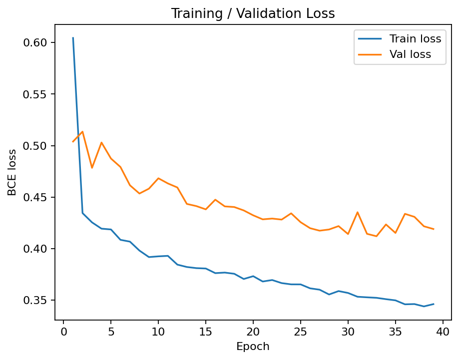
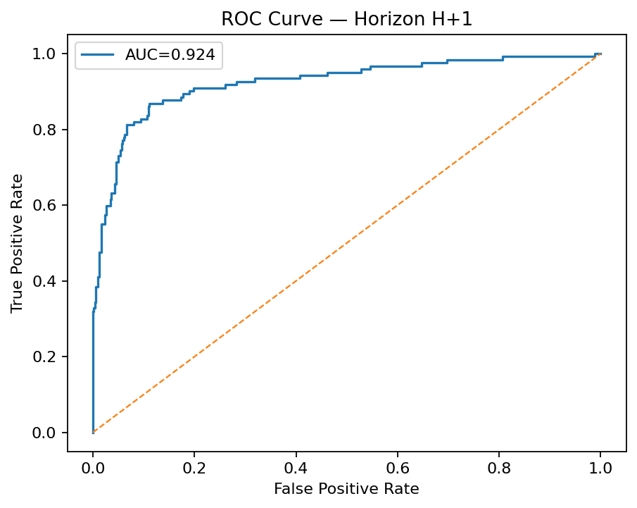
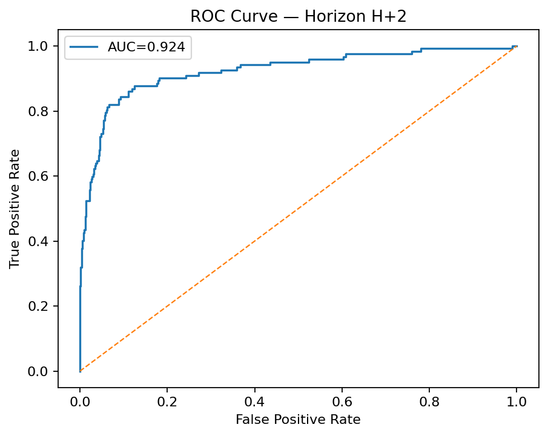
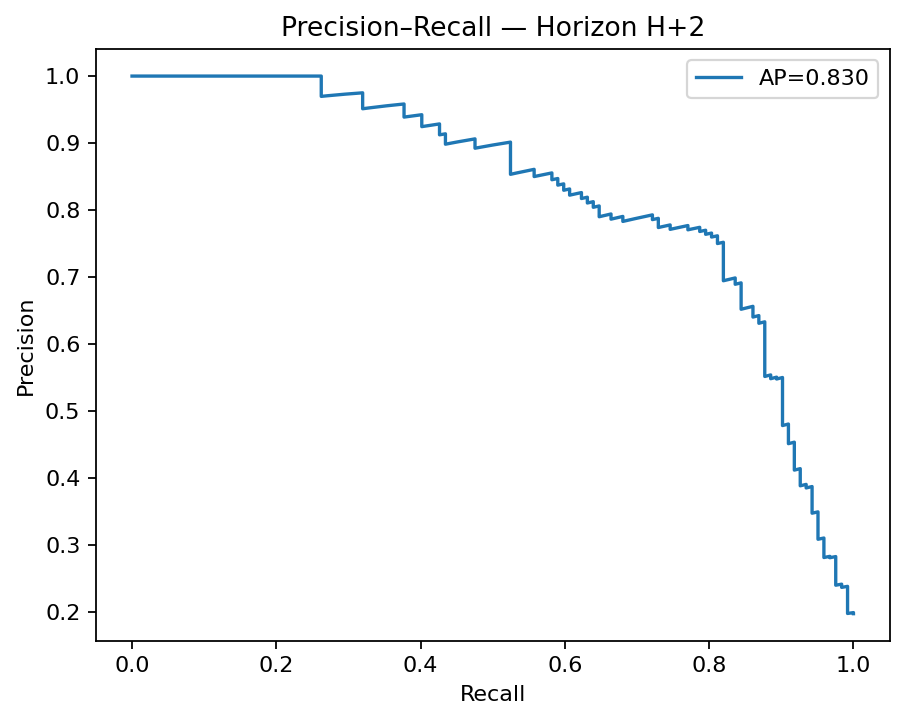

# 🔥 Delhi Heatwave Predictor

A machine learning project to **predict upcoming heatwaves in Delhi** using open-source weather data (NASA POWER) and an LSTM sequence model trained in PyTorch.

The system:

* Downloads historical daily weather for Delhi (temperature, humidity, wind, radiation).
* Labels heatwaves using IMD-like thresholds.
* Trains an LSTM to predict **1–7 days ahead**.
* Tunes per-horizon thresholds for best F1.
* Provides a **Streamlit dashboard** to explore data coverage, forecasted heatwave spells, and recent history.
* Outputs training/evaluation figures for reports.

---

## 📂 Repo structure

```
delhi-heatwave-predictor/
├─ configs/                # YAML configs
├─ data/                   # raw / interim / processed weather data
├─ models/                 # model code + checkpoints
├─ scripts/                # data prep, training, eval, plotting
├─ src/                    # dataset & feature utilities
├─ reports/                # generated figures & metrics
├─ app/                    # Streamlit dashboard
└─ requirements.txt
```

---

## 🚀 Quickstart

### 1. Setup

```bash
python -m venv .venv
source .venv/bin/activate
pip install -U pip
pip install -r requirements.txt
```

### 2. Download Delhi weather

```bash
make download
```

### 3. Preprocess → label → features → splits

```bash
make preprocess
```

### 4. Train model (early stopping enabled)

```bash
make train
```

### 5. Evaluate metrics per horizon

```bash
make evaluate
```

### 6. Tune thresholds for best F1

```bash
make tune_thresholds
```

### 7. Generate plots & metrics for README

```bash
make plots-train
make plots-eval
make metrics-md
```

### 8. Run dashboard

```bash
make app
# or
streamlit run app/app.py
```

---

## 📊 Results

### Training Curves



*(if monitored, you’ll also have `val_f1.png`)*

### Per-horizon metrics (Test set)

From `reports/metrics/METRICS.md`:

---

## 📊 Per-horizon metrics (Test set)

| Horizon | Prevalence |  ROC-AUC |   PR-AUC | F1@thr | Threshold |
| :-----: | ---------: | -------: | -------: | -----: | --------: |
| **H+1** |      19.7% | 0.924 🟢 | 0.827 🟡 |  0.743 |      0.70 |
| **H+2** |      19.7% | 0.924 🟢 | 0.830 🟡 |  0.736 |      0.52 |
| **H+3** |      19.7% | 0.918 🟢 | 0.801 🟡 |  0.750 |      0.59 |
| **H+4** |      19.9% | 0.916 🟢 | 0.746 🟠 |  0.755 |      0.64 |
| **H+5** |      19.9% | 0.922 🟢 | 0.838 🟡 |  0.746 |      0.67 |
| **H+6** |      19.9% | 0.917 🟢 | 0.788 🟠 |  0.719 |      0.47 |
| **H+7** |      19.9% | 0.915 🟢 | 0.788 🟠 |  0.703 |      0.59 |

**Legend**

* 🟢 Excellent (≥ 0.90)
* 🟡 Good (≥ 0.80)
* 🟠 Moderate (< 0.80)

---

### ROC & PR Curves

Example for first two horizons:
 
 

*(full set in `reports/figures/`)*

---

## 🌐 Streamlit Dashboard

The app displays:

* **Data Coverage**: first/last date of available processed data.
* **Forecast: Next Heatwave Spells** → grouped consecutive days (with duration, min/mean probability, threshold).
* **7-Day Forecast Probabilities** line chart.
* **Forecast Details** table (with highlighted heatwave days).
* **Recent History** of Tmax (standardized; can be adapted to °C).

Run locally:

```bash
streamlit run app/app.py
```

---

## 📌 Notes

* Data: [NASA POWER API](https://power.larc.nasa.gov/) (open, daily, no API key).
* Model: LSTM, multi-horizon, trained with BCE loss and class imbalance weights.
* Early stopping: monitors val_loss (or val_f1 if configured).
* Hardware: Runs on CPU, CUDA, or Apple MPS.

---

⚡ **Next improvements**:

* Keep raw Tmax (°C) alongside scaled values for better interpretability.
* Add calibration (Platt/Isotonic) for probability calibration.
* Deploy dashboard via Streamlit Cloud / Render.

---